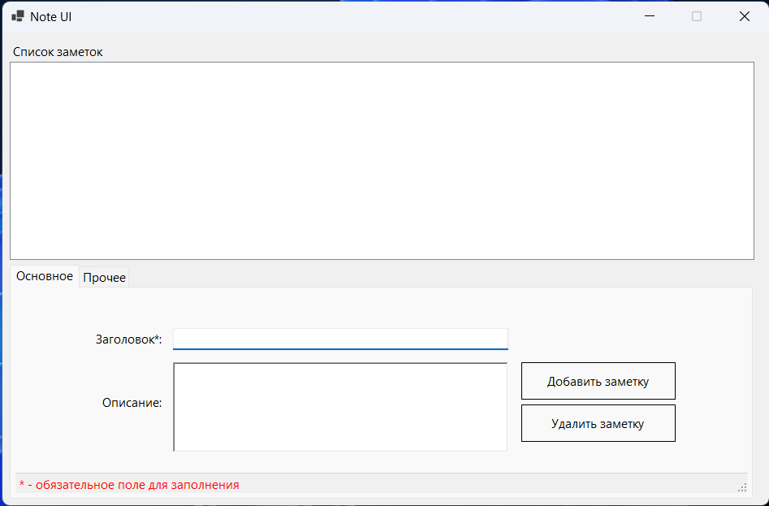
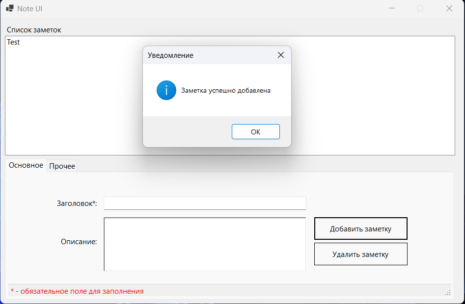
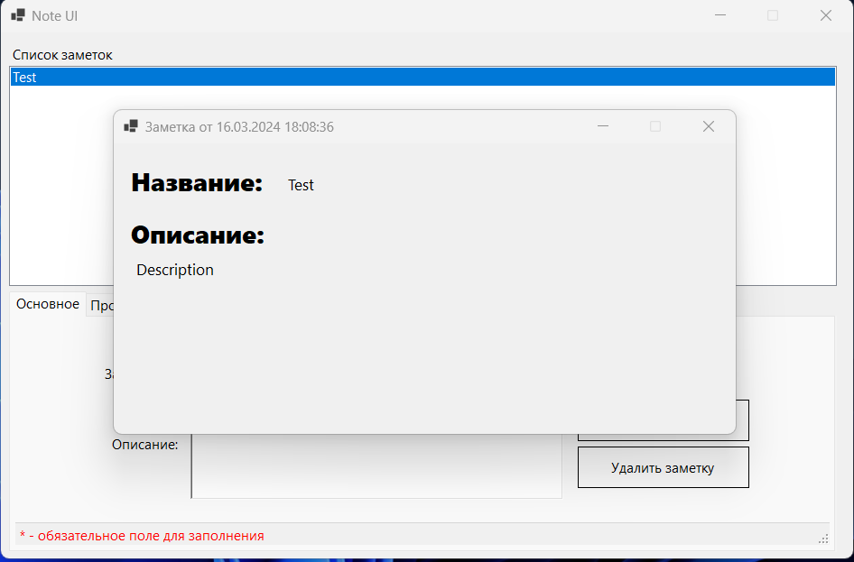

# 📋 NotesApp

**NotesApp** - приложение для для создания быстрых заметок.

## 🌟 Основная функциональность:

### Добавление новой заметки:

Пользователь может добавить новую заметку, указав заголовок и содержание.

### Просмотр списка всех заметок:

Приложение должно отображать список всех заметок с их заголовками.

### Поиск заметки:

Пользователь может ввести ключевое слово или фразу для поиска.

### Удаление заметки:

Пользователь может выбрать заметку из списка и удалить её.

## 📸 Скриншоты





## 👷 Установка и первый запуск

Перед началом установки, убедитесь что у вас установлены следующие инструменты:

- .NET 8.0 SDK - [скачать](https://dotnet.microsoft.com/download/dotnet/8.0)
- IDE (Visual Studio 2022, Rider или
  другая) - [скачать Visual Studio 2022](https://visualstudio.microsoft.com/ru/vs/preview/)

1. Откройте проект в Visual Studio 2022 или Rider.
2. Подождите пока восстановятся все зависимости.
3. Скомпилируйте проект и запустите из IDE `NotesApp.Desktop`.

По умолчанию проект запускается в режиме разработки и ведет логирование в консоль (логгируется на уровне БД).

Чтобы выключить этот режим, перейдите в файл `MainForm.cs` и замените `IsDevelopment` на `true`

```csharp
internal partial class MainForm : Form {
    /// <summary>
    ///     Строка подключения к БД.
    /// </summary>
    private const string ConnectionString = "Data Source=notes.db";

    /// <summary>
    ///     Флаг, указывающий, что приложение запущено в режиме разработки.
    /// </summary>
    private const bool IsDevelopment = true; // было false
    ...
}
```

## 🏠 Архитектура приложения

Проект состоит из 4 слоев:

- **Notes.Desktop** - слой представления, отвечает за отображение данных и взаимодействие с пользователем.
- **Notes.Database** - слой доступа к данным, отвечает за взаимодействие с БД.
- **Notes.Models** - слой моделей, отвечает за хранение данных.
- **Notes.Tests** - слой с юнит-тестами.

## ⚡️Используемые технологии:

- Фреймворк для работы с БД - [Entity Framework Core SQLite](https://github.com/dotnet/efcore).
- Используется паттерн проектирования **MVP** (Model-View-Presenter).
- Все слои приложения разделены друг от друга, что позволяет легко изменять их и добавлять новые функции.
- Юнит-тесты написаны с использованием библиотеки [NUnit](https://nunit.org/).


